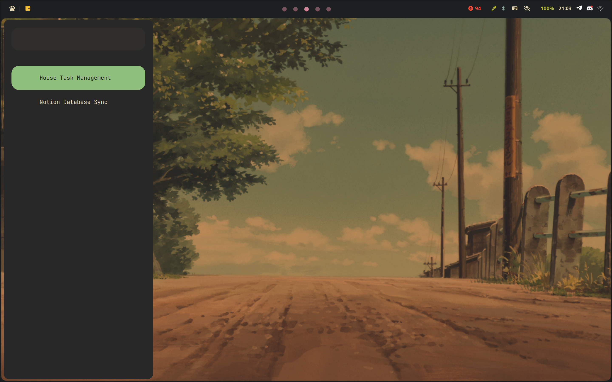
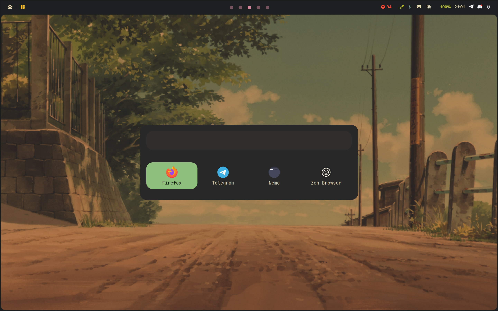
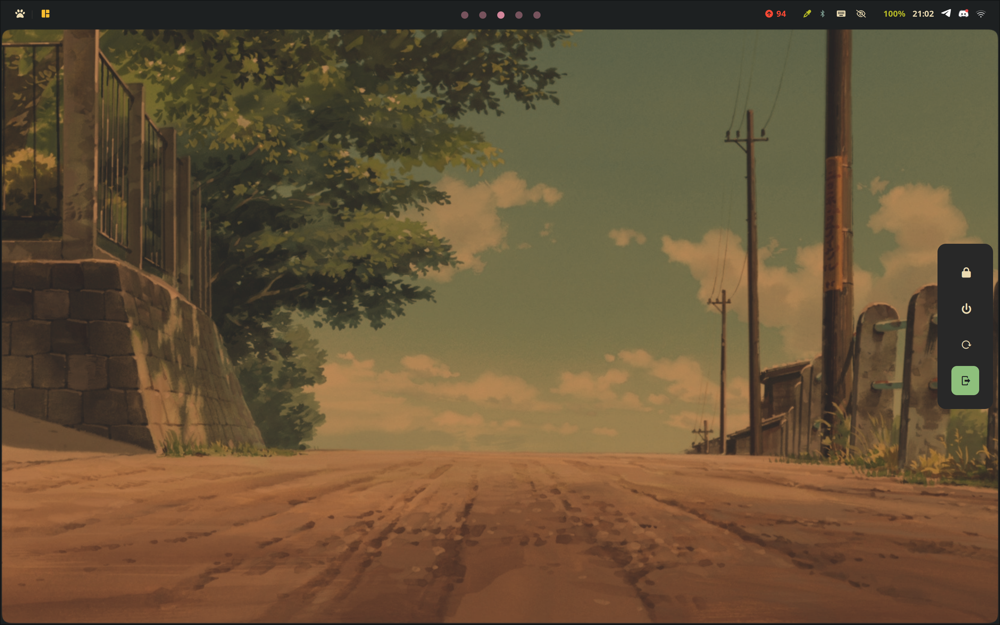
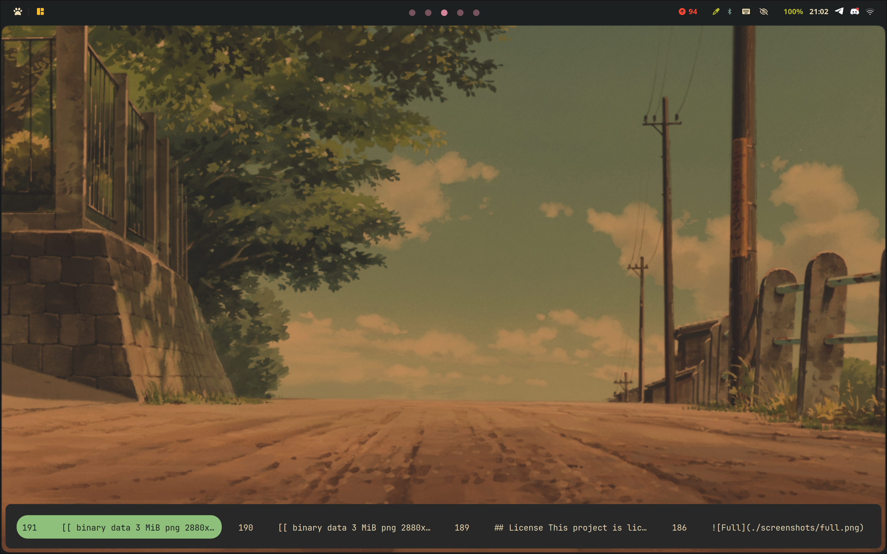

# Rofi themes

# Preview

## Side



## Launcher



## Power



## Bottom



# Example usage:

## Power menu

```shell
#!/bin/bash
if pgrep -x rofi; then
    killall rofi
else
	case $(printf "%s\n" "󰍃" "󰑓" "⏻" "" | rofi -dmenu -theme selector) in
		"󰍃")
			hyprctl dispatch exit exit
			;;
		"󰑓")
			exec systemctl reboot -i
			;;
		"⏻")
			exec systemctl  poweroff -i
			;;
		"")
			# lock the screen
			;;
	esac
fi
```

## Clipboard (cliphist)

```shell
#!/bin/bash
if pgrep -x rofi; then
    killall rofi
else
    cliphist list | rofi -dmenu -theme bottom | cliphist decode | wl-copy
fi

```

## Launcher

```shell
#!/bin/bash
rofi -show drun -theme launcher
```

## License

This project is licensed under the MIT License - see the [LICENSE](LICENSE) file for details.
